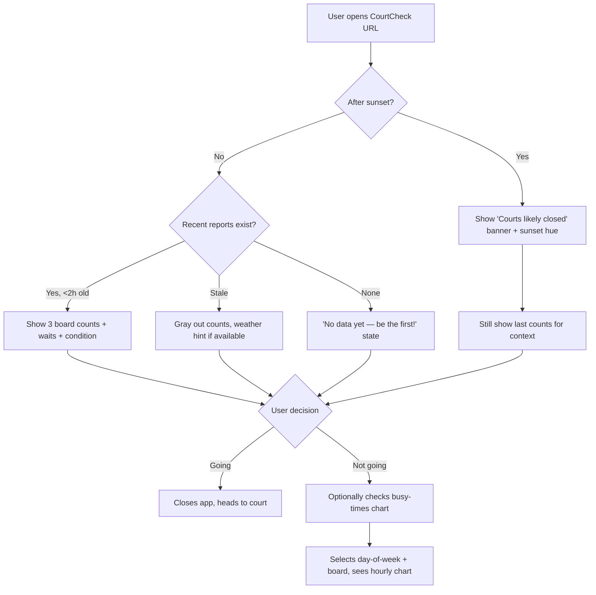
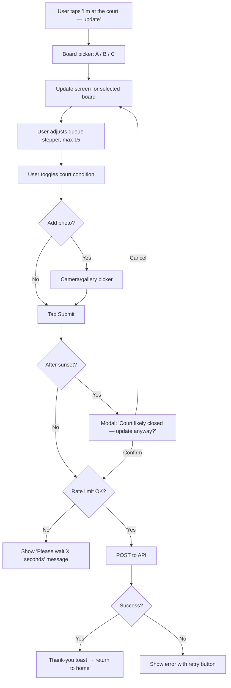
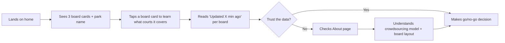
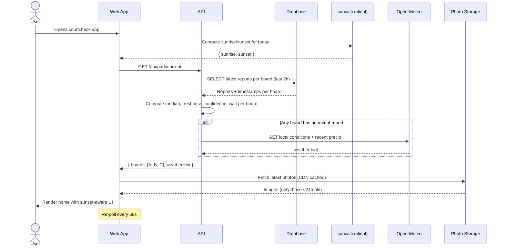
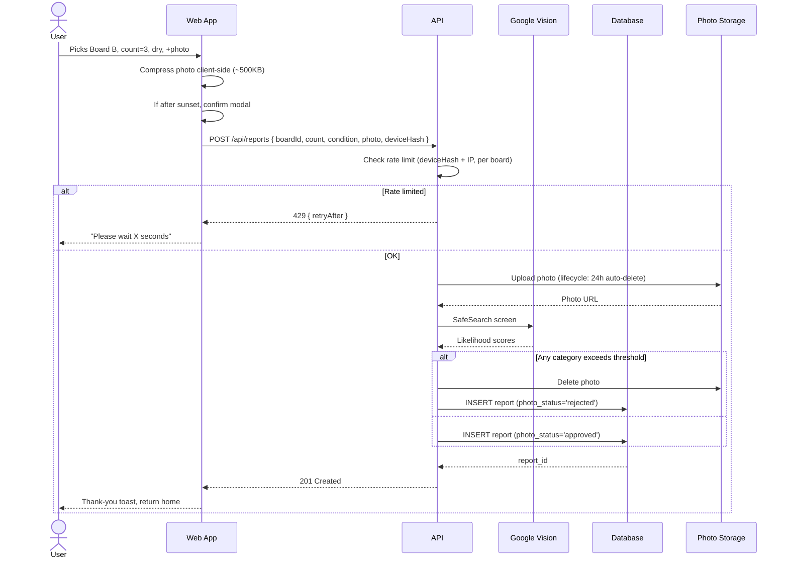
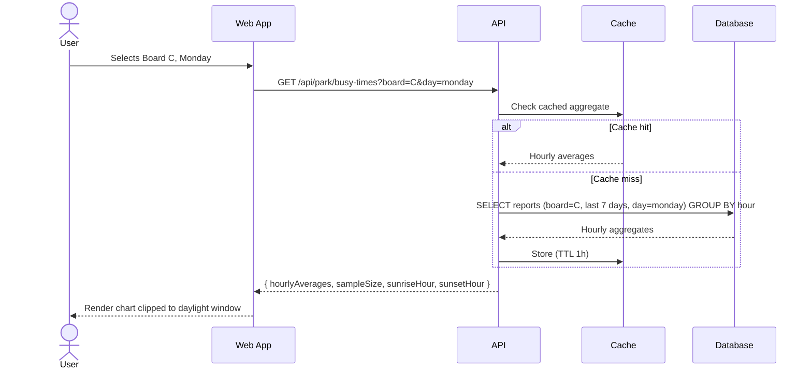

# CourtCheck — Product Requirements Document

> **Version:** 1.1-spec (Ready to build — design locked)
> **Last updated:** April 28, 2026
> **Author:** _[Your name]_
> **Status:** Spec frozen for v1 — open questions tracked for in-build resolution
> **Companion doc:** [`TECH_DESIGN.md`](./TECH_DESIGN.md)
> **Target court:** Ramsden Park, Toronto

---

## Table of Contents

1. [Overview](#1-overview)
2. [Problem & Opportunity](#2-problem--opportunity)
3. [Goals & Non-Goals](#3-goals--non-goals)
4. [Target Users](#4-target-users)
5. [Court Context — Ramsden Park](#5-court-context--ramsden-park)
6. [User Stories](#6-user-stories)
7. [User Flows](#7-user-flows)
8. [Features (v1 Scope)](#8-features-v1-scope)
9. [UX & Screens](#9-ux--screens)
10. [Sequence Diagrams](#10-sequence-diagrams)
11. [Constraints](#11-constraints)
12. [Edge Cases](#12-edge-cases)
13. [Analytics](#13-analytics)
14. [Monitoring](#14-monitoring)
15. [Tech Debt & Hidden Costs](#15-tech-debt--hidden-costs)
16. [Success Metrics](#16-success-metrics)
17. [Future Features](#17-future-features)
18. [Open Questions](#18-open-questions)
19. [Appendix](#19-appendix)

---

## 1. Overview

**CourtCheck** is a mobile-first public web app for **Ramsden Park tennis courts** in Toronto. It tells players, in real time, how busy each of the park's three queue boards is, what the estimated wait time is, and whether the courts are usable right now (dry, lit by daylight). Players passing by or already waiting can update the queue counts and court condition; everyone benefits from the shared info.

This is a personal portfolio project. Goals: (1) ship something genuinely useful for Ramsden Park players, (2) demonstrate a multi-tool AI workflow — Variant AI for design, Claude Code for implementation, Claude for product/PRD work — and (3) build a clean, scalable codebase that can later expand to other public courts.

---

## 2. Problem & Opportunity

### 2.1 The problem

Ramsden Park has 8 public courts split across 3 queue boards (2 + 2 + 4). It's first-come-first-served, walk-up only. Players currently have no way to know how busy any board is without going there. The result: wasted trips during peak hours, surprise closures after rain, and the worst case — arriving after sunset to find the courts unlit and unusable.

### 2.2 Why now

- Smartphones make on-the-spot crowdsourced reporting trivial.
- Tennis and pickleball participation continues to grow at public facilities in Toronto.
- Existing reservation apps don't cover Ramsden, and likely never will — it's a city park, not a club.

### 2.3 Opportunity

A lightweight, location-specific tool that requires no account to read and only minimal friction to update. Crowdsourcing works here because Ramsden has a strong regular-player community clustered in time (peak hours, weekends) and motivated to help each other.

---

## 3. Goals & Non-Goals

### 3.1 Goals (v1)

1. Let any visitor view live queue counts for **all three boards** + estimated wait + court condition in **under 3 seconds**.
2. Let any visitor submit an update for a specific board in **under 15 seconds**, with optional photo.
3. Show **sunrise/sunset times** and clearly indicate when the courts are likely closed (no lights at Ramsden).
4. Show a **7-day historical busy-times chart** per board so users can plan ahead.
5. Function reliably as a **mobile web app** — no app store, no install required.
6. Build a clean, well-documented portfolio piece that showcases an AI-augmented dev workflow.

### 3.2 Non-goals (v1)

- Multi-court / multi-park expansion (designed for, but not built for v1).
- Court reservations or paid bookings.
- User accounts, profiles, friend systems, or chat.
- Native iOS/Android apps.
- Push or SMS notifications (deferred to v2).
- Realtime updates — v1 uses polling; realtime is a v2 polish.
- Automated detection (e.g., camera-based queue counting).
- Aggregate "park is busy" view — we explicitly chose per-board over aggregate.

---

## 4. Target Users

### 4.1 Primary persona — "The Ramsden Regular"

Lives or works in Rosedale, the Annex, Yorkville, or Summerhill. Plays at Ramsden multiple times a week. Knows which board covers which courts. Strongly prefers to skip the trip if their preferred board is full. Will happily contribute updates because they directly benefit from others doing the same.

### 4.2 Secondary persona — "The Drop-in Visitor"

Plays occasionally or is visiting Toronto. Would use the app to read queue info, less likely to contribute updates. Doesn't necessarily know which board to use; the UI must make the board layout self-explanatory.

### 4.3 Anti-persona — "The Reservation User"

Someone looking to book a private court. Not the target. Ramsden is walk-up only.

---

## 5. Court Context — Ramsden Park

| Field | Value |
|-------|-------|
| **Name** | Ramsden Park |
| **Address** | 1020 Yonge St & Ramsden Park Rd, Toronto, ON M4W 1P7 |
| **Approximate coordinates** | 43.6772° N, 79.3919° W |
| **Timezone** | America/Toronto |
| **Total courts** | 8 |
| **Surface** | Hard court |
| **Lights** | None |
| **Operating hours** | Sunrise to sunset (no fixed schedule; no after-dark play) |
| **Booking model** | First-come-first-served, walk-up only |

### 5.1 Queue board layout

Ramsden uses three physical fence-mounted racket boards. Each board governs a distinct subset of courts:

| Board | Courts covered | # of courts |
|-------|---------------|-------------|
| **Board A** | Courts 1–2 | 2 |
| **Board B** | Courts 3–4 | 2 |
| **Board C** | Courts 5–8 | 4 |

> _Court numbering is provisional — confirm against the actual on-site signage and update this table accordingly._

This split is critical to the product. A 4-racket queue on Board C clears in roughly the time it takes a 2-racket queue on Board A to clear, because Board C has twice the courts. Treating the park as a single queue would hide this and mislead users.

### 5.2 Sunrise/sunset

Calculated locally using the `suncalc` library against the park's coordinates. Times vary significantly across the year:

| Month | Approx. sunrise | Approx. sunset | Daylight hours |
|-------|----------------|----------------|----------------|
| December | 7:50 AM | 4:40 PM | ~8h 50m |
| March (post-DST) | 7:30 AM | 7:30 PM | ~12h |
| June | 5:35 AM | 9:00 PM | ~15h 25m |
| September | 7:00 AM | 7:30 PM | ~12h 30m |

The busy-times chart and "court likely closed" UI must respect these dynamic times — the play window in December is roughly half the size of June's.

---

## 6. User Stories

> Format: As a **[user]**, I want to **[action]** so that **[outcome]**.

### 6.1 Viewing

- As a **player at home**, I want to see queue counts for all 3 boards so I can pick the least busy one.
- As a **player**, I want to see the estimated wait time for each board so I can decide whether to go.
- As a **player**, I want to see if the court is dry or wet so I don't drive over after rain.
- As an **evening player**, I want to see how many minutes until sunset so I know if it's worth heading over.
- As a **viewer after sunset**, I want a clear "courts likely closed" indication so I don't waste a trip.
- As a **planner**, I want to see a busy-times chart for the past week so I can pick a good time to play.
- As a **viewer**, I want a recent photo of the court so I can verify the report looks legitimate.

### 6.2 Reporting

- As a **player at the court**, I want to update the queue count for the specific board I'm waiting at, in two taps.
- As a **reporter**, I want to attach a photo as proof so others trust the count.
- As a **reporter**, I want to mark the court as wet so others don't waste a trip.

### 6.3 Trust

- As a **viewer**, I want stale reports (>2 hours old) clearly flagged so I know not to rely on them.
- As a **viewer**, I want to see how many people have confirmed a recent count so I can gauge confidence.
- As a **viewer with no recent report**, I want a weather-based hint (e.g., "rained 2h ago — possibly wet") so the empty state is still useful.

---

## 7. User Flows

### 7.1 Viewer flow (the 90% case)



### 7.2 Reporter flow



### 7.3 First-time user flow



---

## 8. Features (v1 Scope)

| ID | Feature | Description | Priority |
|----|---------|-------------|----------|
| **F1** | 3-board live display | Three cards on home, one per board (A/B/C). Each shows: queue count, estimated wait, last-updated time, condition badge, confirmation count. | **P0** |
| **F2** | Estimated wait time | For each board: `wait_minutes = (queue_count / courts_on_board) × 30`. Display as `"~30 min (typically 25–40)"`. | **P0** |
| **F3** | Quick queue update | Board picker → stepper (0–15) → optional condition + photo → submit. Submit defaults to last reported value for that board. | **P0** |
| **F4** | Court condition toggle | Per board: Dry / Wet / Unknown. (One board may be wet from a sprinkler while another is dry.) | **P0** |
| **F5** | Weather fallback hint | When no recent report exists for a board, fetch local weather and display a soft hint (e.g., "Last rain ~2h ago — possibly wet"). User reports always override. | **P0** |
| **F6** | Photo upload (optional) | Camera/gallery picker; uploads compressed to ~500KB; latest photo per board. **Auto-deleted 24 hours after upload.** Moderation via Google Vision SafeSearch. | **P0** |
| **F7** | Sunrise/sunset awareness | Compute today's sunrise/sunset locally. Show "X min until sunset" warning during last hour. After sunset: "Courts likely closed" banner + sunset hue background. | **P0** |
| **F8** | Historical busy-times | Bar chart of average queue by hour for last 7 days. Filter by board and day-of-week. X-axis dynamically clipped to seasonal sunrise/sunset window. | **P0** |
| **F9** | Stale-data flagging | If newest report is >2 hours old, gray out the count with "No recent updates" label. | **P0** |
| **F10** | Polling refresh | Home screen polls `GET /api/park/current` every 60 seconds (and on tab focus). Realtime push deferred to v2. | **P0** |
| **F11** | Anti-spam protection | Rate-limit per IP/device (1 update per board per 90 seconds). | **P1** |
| **F12** | Photo moderation | Google Vision SafeSearch screen on upload. Reject before storing if any category exceeds threshold (see TDD). | **P1** |
| **F13** | About page | Brief explanation, board layout diagram, contact link, data practices. | **P2** |

### 8.1 Wait time formula — design notes

```
base_wait_minutes = (queue_count / courts_on_board) × 30
display_low  = round(base_wait × 0.83)   // ~ -17%
display_high = round(base_wait × 1.33)   // ~ +33% (asymmetric: matches go long more than they go short)
display_text = "~{base} min (typically {low}–{high})"
```

Edge cases:
- `queue_count = 0` → display "No wait — court likely open"
- After sunset → wait time hidden (not meaningful when courts are closed)
- The formula is an assumption baseline; calibrate against real data once collected.

### 8.2 Court tile color rule

**All courts on the same board share the same status color** in the home-screen map. Status is computed per-board, not per-court (we don't track per-court occupancy in v1). This means Courts 5–8 (all on Board C) always render the same color as each other, even if it's visually less varied. This is intentional: implying per-court status would mislead users.

Status colors map to the five status pills:
- **FREE** (sage) — `queue_count = 0` or wait ≤15 min
- **MODERATE** (amber) — wait 15–40 min
- **LONG WAIT** (terracotta) — wait >40 min
- **STALE** (gray) — newest report >2 hours old
- **CLOSED** (dusk-blue) — current time > sunset
- **NO DATA** (warm cream/sand) — no reports ever, distinct from STALE

---

## 9. UX & Screens

### 9.1 Screen 1 — Home (default view)

- **Header:** "Ramsden Park" + park photo (latest user-submitted, or default if none)
- **Sunset/sunrise indicator** at top: "☀️ Sunrise 6:45 AM · 🌅 Sunset 7:48 PM" or "🌅 Sunset in 23 minutes"
- **Three board cards**, stacked vertically, each containing:
  - Board name + which courts it covers ("Board C · Courts 5–8")
  - Big number: queue count
  - Wait estimate: "~30 min (typically 25–40)"
  - Last-updated + confirmation count
  - Condition badge (Dry / Wet / Unknown / weather-hint)
- **Primary CTA:** "I'm at the court — update"
- **Secondary CTA:** "View busy times"
- **After sunset:** banner across top "🌙 Courts likely closed — sunset was at 7:48 PM"; background takes a sunset/dusk hue (warm orange to deep blue gradient)

### 9.2 Screen 2 — Update queue

- **Step 1:** Board picker (A / B / C as large tap targets, with court ranges shown)
- **Step 2:** Update form for chosen board:
  - Number stepper (− and + buttons, large tap targets), **range 0–15**
  - Court condition toggle (Dry / Wet)
  - Optional: "Add photo" button
  - Submit
- **After-sunset confirmation:** if `now > sunset`, show modal "Court likely closed — update anyway?" before submit fires
- **On success:** thank-you toast and return to home

### 9.3 Screen 3 — Busy times

- Board selector chips (A / B / C)
- Day-of-week selector (chips: Mon–Sun)
- Bar chart: average queue by hour, x-axis from earliest seasonal sunrise to latest seasonal sunset
- Sample-size indicator
- Note: "Courts unlit — only daylight hours shown"

### 9.4 Design notes

- **Mobile-first**, 380–420px viewport as the primary target.
- **Sunset hue:** background gradient shifts smoothly from neutral (daytime) to warm orange (~30 min before sunset) to deep dusk blue (after sunset). Not just decorative — it's a peripheral-vision cue that "the window is closing."
- **Board cards** use color tokens distinct enough that returning users learn them visually (A=terracotta, B=amber, C=sage). Locked from Variant design pass.
- Glanceable typography, generous tap targets (≥44px), high-contrast tennis palette layered with the sunset hue system.
- Optimize for one-handed use and slow connections at the court.

### 9.5 Home screen state matrix

The home screen has five distinct states. All use the same layout; only colors and copy change.

| State | Trigger | Court tiles | Sun strip | Background |
|-------|---------|------------|-----------|------------|
| **Daytime / live** | Reports <2h old | Status colors per board | "Sunrise X · Sunset Y" (calm) | Neutral cream |
| **No data yet** | Zero reports ever for any board | Warm cream/sand (all 8) | Standard sun strip | Neutral cream; cards show "Be the first to update" empty card |
| **Stale** | Some/all reports >2h old | Gray for stale boards | Standard sun strip | Neutral cream |
| **Pre-sunset** | <30 min until sunset | Status colors (unchanged) | "Sunset in N minutes" in warm amber | Subtle warm wash fading toward bottom |
| **Post-sunset** | Now > sunset | All dusk-blue (closed) | "Courts likely closed — sunset was at HH:MM" | Full warm-orange-to-dusk-blue gradient |

### 9.6 Design tokens (locked from Variant)

The Tailwind config is the source of truth. See [`TECH_DESIGN.md` §3.2](./TECH_DESIGN.md) for the full token block. Key colors:

- Background: `#EAE5DB` (warm mushroom)
- Text: `#222220` (charcoal); muted: `#7A766F`
- Cream (button text): `#F8F6F1`
- Board A / Long Wait: `#BC5F48` (terracotta) — dark variant `#A64F3A`
- Board B / Moderate: `#D49A4C` (amber)
- Board C / Free: `#7C8B70` (sage) — dark variant `#6A795F`
- Closed: `#4A5D70` (dusk)
- Stale: `#A8A49C` (gray)
- Display serif: Playfair Display
- UI sans: Inter

---

## 10. Sequence Diagrams

### 10.1 Viewing the home screen



### 10.2 Submitting a queue update



### 10.3 Loading the busy-times chart



---

## 11. Constraints

### 11.1 Product constraints

- **No login.** Anything that requires accounts kills adoption for a casual tool. Reads are fully public; writes are crowdsourced.
- **Mobile-first.** Most reporters are at the court holding a phone in one hand. Desktop is a nice-to-have.
- **Single-park v1.** Don't build multi-park abstractions until needed — but the schema and API must not bake in single-park assumptions.
- **No-lights reality.** The sunset/sunrise feature isn't decorative — at Ramsden, after sunset, there is genuinely nothing to do. The UI must respect this.
- **Photos are ephemeral.** 24-hour auto-delete is a privacy + cost win. Any UI that implies photo permanence is wrong.

### 11.2 Technical constraints

- **Free/cheap hosting.** Personal project; budget should be near zero. Pick a stack with a generous free tier.
- **Cold-start friendly.** Without seed data, the app must still feel useful (clear empty states, "be the first" prompts, weather hints).
- **Latency budget:** TTI under 3s on a 4G connection.
- **Local sunrise/sunset computation.** Must work offline / without an external API call (use `suncalc`).
- **Polling, not push** in v1 — keeps the architecture simpler. Realtime is a v2 enhancement.

### 11.3 Legal / privacy constraints

- No PII collection. Device hashes are one-way, not joinable to identity.
- Public photos may capture bystanders. Auto-moderation + 24h auto-delete + a takedown path is required.
- About page must disclose data practices.

---

## 12. Edge Cases

| # | Edge case | Expected behavior |
|---|-----------|-------------------|
| 1 | First-ever visit, no reports in DB | Empty state per board: "No data yet — be the first to update!" |
| 2 | Reports exist for Board A only, B and C empty | Show A's data, B and C show empty state independently |
| 3 | All reports >2h old | Gray out counts, show weather hint where applicable |
| 4 | User submits report, then immediately submits another for same board | Rate-limited: "You just updated Board X — please wait Y seconds" |
| 5 | User submits to Board A, then to Board B back-to-back | Allowed (rate limit is per-board, not global) |
| 6 | Photo upload fails (network, oversized, rejected by moderation) | Submit the report without photo; toast: "Update saved, photo couldn't be uploaded" |
| 7 | User submits an absurd count (e.g., 99) | Validate range 0–15 client- and server-side; reject with friendly error |
| 8 | Photo flagged as inappropriate by SafeSearch | Discard photo silently; textual report still posts |
| 9 | DST transitions (Toronto observes DST) | Aggregate in `America/Toronto` local time, not UTC. Sunrise/sunset auto-adjust via suncalc |
| 10 | User loads page offline | Show cached last-known state with "offline" indicator and a stale-reload button |
| 11 | Rain just stopped, courts still wet, no recent report | Weather hint: "Rained 30 min ago — likely still wet" |
| 12 | After sunset, but someone insists on submitting | Show "Court likely closed" modal; allow override |
| 13 | Sunset boundary edge (e.g., 7:48 PM with submit at 7:47:50 PM) | Use the sunset boundary as a soft check, not a hard block. Within 2 minutes either side, no warning. |
| 14 | Bot/spam attack flooding the endpoint | Rate-limit by IP + deviceHash + board; alert via monitoring; fall back to static last-good state |
| 15 | Photo storage quota hit | 24h auto-delete should prevent this; if still hit, alert and tighten retention to 12h |
| 16 | Weather API is down or quota exhausted | Skip the hint silently; never block the page render on weather |
| 17 | A board's queue clears (count goes from 5 to 0) | Show "No wait — court likely open" instead of "~0 min"; treat as a positive signal |
| 18 | December — sunset at 4:40 PM, busy-times chart x-axis | Clip x-axis to the day's actual daylight window, not a fixed 6 AM–10 PM range |
| 19 | Photo deleted at 24h boundary while user is viewing | Photo URL returns 404; UI gracefully falls back to default park photo |
| 20 | Polling fires while user is in the update flow | Don't interrupt; pause polling on `/update` route, resume on home |

---

## 13. Analytics

### 13.1 Why we instrument

Two reasons: (1) measure whether the product is working (success metrics in §16), (2) catch real-world bugs the dev environment won't surface.

### 13.2 Events to track

| Event | When | Properties |
|-------|------|------------|
| `page_view` | Any page load | path, referrer, deviceType |
| `home_loaded` | Home screen rendered | board_a_freshness_min, board_b_freshness_min, board_c_freshness_min, post_sunset, has_weather_hint |
| `board_card_tapped` | User taps a specific board card | board_id |
| `update_started` | User taps "I'm at the court" | source (home/about) |
| `update_board_selected` | User picks board in update flow | board_id |
| `update_submitted` | Successful POST | board_id, count, condition, has_photo, time_to_submit_seconds, post_sunset |
| `update_failed` | POST returned error | board_id, error_code, retry_attempted |
| `post_sunset_override` | User confirmed update after sunset | board_id, minutes_after_sunset |
| `busy_times_viewed` | User opens chart | board_id, day_selected, sample_size |
| `weather_hint_shown` | Hint rendered on home | board_id, hint_type |
| `photo_rejected` | Moderation fails | rejection_reason |
| `rate_limited` | 429 response | endpoint, board_id |
| `stale_state_shown` | Home rendered with stale data for any board | board_id, minutes_since_last_update |

### 13.3 Tooling

**Plausible Analytics** (free for personal projects, privacy-friendly, no cookie banner needed). Avoid Google Analytics for a public crowdsourced tool — it complicates the privacy story and adds a banner.

---

## 14. Monitoring

### 14.1 What to watch

| Layer | Metric | Threshold | Action |
|-------|--------|-----------|--------|
| Frontend | JS error rate | >1% of sessions | Investigate via Sentry |
| Frontend | Largest Contentful Paint (p75) | >3s | Investigate; optimize |
| API | Error rate (5xx) | >0.5% of requests | Page on-call (you) |
| API | Latency (p95) | >800ms | Investigate |
| API | Rate-limit hits | Spike vs baseline | Possible abuse — review logs |
| DB | Query duration (p95) | >300ms | Add index or optimize |
| Storage | Storage used | >80% of free tier | Tighten 24h expiry; or reduce per-board retention |
| Vision API | Quota usage | >80% of monthly budget | Reduce upload rate or upgrade |
| Moderation | Photo rejection rate | >50% sustained | Tune thresholds — likely false positives |
| Weather API | Error rate | >5% | Increase cache TTL or skip hints |
| Photo lifecycle | Photos older than 24h | >0 | Lifecycle rule failed — investigate |

### 14.2 Tooling

- **Sentry** — frontend + backend error tracking
- **Vercel Analytics** — performance metrics
- **BetterStack** or **UptimeRobot** — synthetic uptime checks against home page
- **PostHog** (optional) — analytics + session replay if you want to see real user issues

### 14.3 Logging

Structured JSON logs at the API layer with: `timestamp`, `request_id`, `endpoint`, `board_id`, `status`, `duration_ms`, `device_hash` (already hashed), `error` (if any). Never log raw IPs or photo bytes.

---

## 15. Tech Debt & Hidden Costs

### 15.1 Likely tech debt

- **Single-park hardcoding.** Even with `park_id` in the schema, UI copy will drift toward "the park" wording. Plan for a refactor when adding park #2.
- **Three-board hardcoding.** The number `3` will sneak into UI components (carousels, color tokens). Make it data-driven from the start.
- **No test coverage at v1.** Tempting to skip; for a portfolio piece, basic tests on the API endpoints are worth the time and look better to reviewers.
- **Polling instead of realtime.** Acceptable for v1, but adds noise to logs and wastes free-tier requests. Plan v2 migration to Supabase Realtime.
- **Wait-time formula calibration.** `30 min × queue / courts` is an assumption. After 2–3 months of real data, fit the formula to actual observed clear times.
- **Sunset edge cases.** "Court likely closed at sunset" is an approximation — civil twilight gives ~20 minutes of usable light past sunset. Might want to use civil-twilight-end instead of sunset for v2.

### 15.2 Hidden costs

- **Photo storage and bandwidth.** 24h auto-delete keeps this small, but bandwidth for serving photos still counts. Cap photo size, monitor.
- **Google Vision SafeSearch.** First 1,000 units/month are free; beyond that ~$1.50 per 1,000. At low volume this is cents; budget for it.
- **Weather API.** Open-Meteo is free and key-less; cache aggressively (15-min TTL) to stay polite.
- **Cold-start tax.** Serverless functions on free tiers have cold starts (200ms–2s). For "is the court busy *right now*", that latency is felt.
- **Polling cost.** Every viewer tab polling every 60s = lots of free-tier API calls. Edge cache is essential.
- **Domain.** $10–15/yr.
- **Operational time.** Moderation queue, abuse handling, takedown requests. Build them in from day one or you'll be doing them manually.

### 15.3 Decisions that hurt later

- Storing IPs in plaintext (privacy + compliance pain).
- Putting all reports in one table without partitioning by month (slow at scale; fine at MVP).
- Tightly coupling photo storage to a specific provider; an interface layer makes migration trivial.
- Hardcoding sunrise/sunset for Toronto in client code instead of computing per coordinate.

---

## 16. Success Metrics

### 16.1 Engagement

- Daily active viewers (target: 25+ within first month — Ramsden has high foot traffic)
- Daily updates submitted across all 3 boards (target: 15+ per day during peak season)
- Update-to-view ratio (healthy: ~1 update per 5–10 views)

### 16.2 Quality

- Median report freshness during peak hours (target: <30 minutes per board)
- % of updates with photos (target: 30%+)
- Wait-time accuracy (target: actual clear time within ±30% of estimate, measured retroactively)

### 16.3 Portfolio metrics

- Code quality, test coverage, documentation completeness
- Public README with architecture diagram and AI-tool workflow narrative
- Live demo URL

---

## 17. Future Features

| Idea | Notes |
|------|-------|
| **Realtime updates** (v2 polish) | Supabase Realtime so the count refreshes instantly without polling |
| **Multi-park expansion** | Toronto has dozens of public courts — replicate Ramsden model elsewhere |
| **Push notifications when queue clears** | Web push (no app needed); notify users who opted in |
| **Per-court status** (within a board) | "Court 5 of Board C is closed for resurfacing" |
| **Civil twilight cutoff** | More accurate than sunset for "still playable" |
| **Skill-level matching** | "Anyone want to play? Intermediate, here for 1 hour" |
| **Pickleball / multi-sport** | Same model, different surface |
| **Community moderators** | Trusted users can suppress bad reports |
| **Wait-time ML model** | Once you have real data, fit observed clear times to predict wait |
| **Calendar integration** | "Add reminder for tomorrow's quiet window" |
| **Public API** | Let other tools embed Ramsden's count |
| **Camera/CV automation** | Future-future where a camera counts rackets automatically |

---

## 18. Open Questions

> All blocking questions for v1 are resolved. Remaining items are tracked for resolution during implementation, not before.

1. ~~Target court?~~ **Resolved: Ramsden Park.**
2. ~~Tech stack?~~ **Resolved: Next.js + Supabase + Vercel.**
3. ~~Photo moderation?~~ **Resolved: Google Vision SafeSearch.**
4. ~~Photo retention?~~ **Resolved: 24h auto-delete.**
5. ~~Queue stepper max?~~ **Resolved: 0–15.**
6. ~~Realtime vs polling?~~ **Resolved: polling in v1, realtime as v2.**
7. **Court numbering** — confirm "Courts 1–2 / 3–4 / 5–8" matches actual Ramsden signage. _Resolve on-site during week 6 testing._
8. **Domain name** — placeholder for now; pick before launch.
9. ~~Color tokens for boards (A/B/C)~~ **Resolved: A=terracotta `#BC5F48`, B=amber `#D49A4C`, C=sage `#7C8B70`. Locked from Variant design pass.**

---

## 19. Appendix

### 19.1 Glossary

- **Board (A / B / C):** A physical fence-mounted racket queue board at Ramsden. Each board governs a defined subset of courts.
- **Queue / racket count:** Number of rackets on a board waiting to play, conventionally clipped to mark order.
- **Court condition:** Whether the playing surface is dry, wet, or unknown.
- **Crowdsourced report:** An update submitted by any user without authentication.
- **Confirmation count:** Number of recent (within ~30 min) reports for a board that agree (±1) with the displayed count.
- **Wait estimate:** `(queue_count / courts_on_board) × 30 min`, displayed as a range to honor real-world variance.
- **Sunset hue:** A background color treatment that warms toward orange as sunset approaches and shifts to dusk-blue after.

### 19.2 Change log

- **v1.1-spec (Apr 28, 2026)** — **Design locked.** Two rounds with Variant AI produced the canonical visual system. Added §8.2 court tile color rule (all courts on a board share status color in v1). Added §9.5 home screen state matrix (5 states: daytime, no-data, stale, pre-sunset, post-sunset). Added §9.6 design tokens summary. Resolved board color tokens (A=terracotta, B=amber, C=sage). Distinct "no data yet" warm cream state introduced — different from STALE gray.
- **v1.0-spec (Apr 28, 2026)** — Spec frozen. Queue range tightened to 0–15. Added `photo_expires_at` column and `'expired'` photo status. Added Vercel cron for nightly busy-times aggregation and hourly photo-expiry sweep. Added polling strategy section (§9) including pause-on-update-page rule.
- **v0.3 (Apr 28, 2026)** — Locked in target court (Ramsden Park, Toronto). Restructured for **3-board model** (Boards A/B/C covering 2/2/4 courts). Added wait-time estimate, sunrise/sunset awareness, weather fallback hint, sunset hue background. Updated all flows, sequence diagrams, edge cases, analytics, and monitoring for the per-board model.
- **v0.2 (Apr 27, 2026)** — Converted to markdown for GitHub. Added user flows, sequence diagrams, constraints, edge cases, analytics, monitoring, tech debt, and future features. Split implementation/architecture/schema into companion `TECH_DESIGN.md`.
- **v0.1 (Apr 27, 2026)** — Initial draft based on the founder's brief: single-court, crowdsourced, mobile web, with live count + photo proof + busy-times chart + court condition.
