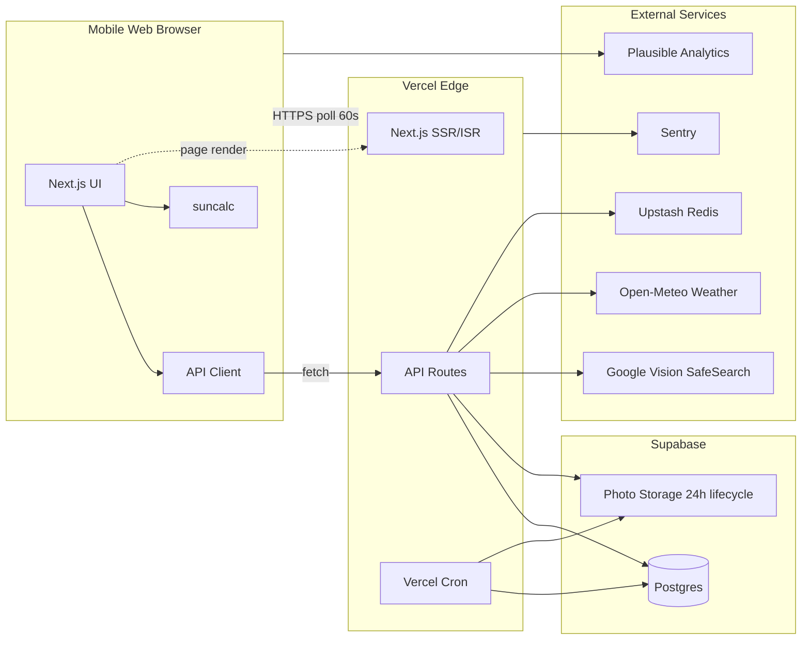
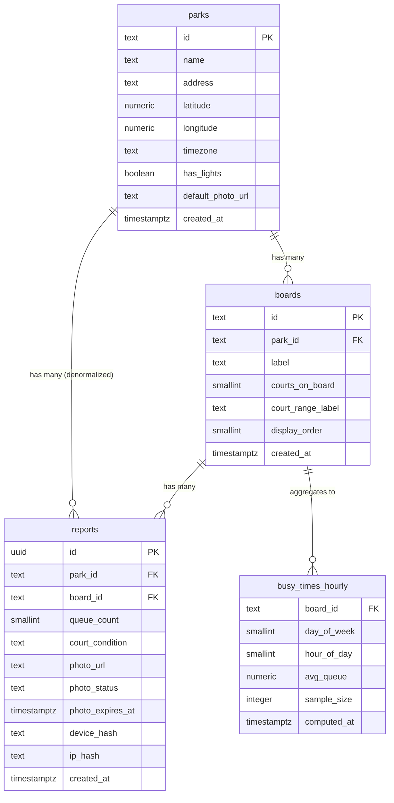
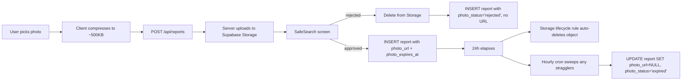
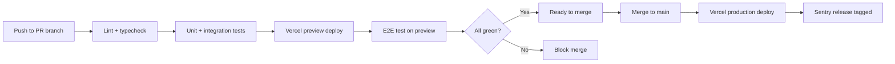

# CourtCheck — Technical Design Document

> **Version:** 1.1-spec (Ready to build — design tokens locked)
> **Last updated:** April 28, 2026
> **Companion doc:** [`PRD.md`](./PRD.md)
> **Status:** Spec frozen for v1
> **Stack:** Next.js 14 + Supabase + Vercel + Google Vision + Open-Meteo + suncalc

---

## Table of Contents

1. [Overview](#1-overview)
2. [Architecture](#2-architecture)
3. [Tech Stack](#3-tech-stack)
4. [Database Schema](#4-database-schema)
5. [API Design](#5-api-design)
6. [API Client (Frontend)](#6-api-client-frontend)
7. [Sunrise/Sunset & Weather](#7-sunrisesunset--weather)
8. [Photo Pipeline & Moderation](#8-photo-pipeline--moderation)
9. [Polling Strategy](#9-polling-strategy)
10. [Implementation Plan](#10-implementation-plan)
11. [Security](#11-security)
12. [Performance](#12-performance)
13. [Testing Strategy](#13-testing-strategy)
14. [Deployment & CI/CD](#14-deployment--cicd)
15. [Open Technical Questions](#15-open-technical-questions)

---

## 1. Overview

This document describes the technical implementation for CourtCheck v1, targeting **Ramsden Park, Toronto**. It is a sibling to `PRD.md`. Where the two conflict, the PRD wins on product behavior; this doc wins on technical decisions.

**Design principles:**

1. **Start simple.** Single park, single region, no horizontal scaling complexity in v1.
2. **Don't paint into a corner.** Schema, API, and code structure should make multi-park easy later.
3. **Ship-ready over clever.** Boring tech that's well-documented beats novel tech that's hard to debug.
4. **Free tier first.** Every dependency must have a usable free tier.

---

## 2. Architecture

### 2.1 High-level architecture



### 2.2 Why this shape

- **Next.js on Vercel** — SSR for fast first paint on the home screen; API routes co-located with the UI; one deploy.
- **Supabase** — Postgres + photo storage on a generous free tier. Postgres handles the per-board time-series aggregation cleanly. **Storage bucket configured with a 24h lifecycle rule** for automatic photo deletion.
- **suncalc on the client** — sunrise/sunset computed locally from coordinates; no API key, no rate limit, no cost, works offline.
- **Open-Meteo for weather** — free, no API key, generous quotas. Cached server-side aggressively (15-minute TTL).
- **Google Vision SafeSearch** — server-side only, never from the client. Photos screened before storage commits.
- **Upstash Redis** — sliding-window rate limiting per board.
- **Vercel Cron** — nightly busy-times aggregation; safety-net photo cleanup (in case lifecycle rule misses anything).
- **No auth in v1** — reads are public; writes are rate-limited by device hash + IP.
- **Polling every 60s** — simpler than realtime push for v1; edge-cached so it doesn't hammer the DB.

### 2.3 Data flow summary

| Action | Path |
|--------|------|
| View home (initial) | Browser → Vercel ISR (cached 30s) → Postgres → (Open-Meteo if no recent reports) |
| View home (polling) | Browser → Vercel API (cached 30s) → Postgres |
| Submit update | Browser (compress) → Vercel API → Upstash (rate limit) → Vision SafeSearch → Supabase Storage → Postgres |
| View busy-times | Browser → Vercel API → cached aggregate (or Postgres + cache miss) |
| Photo expiry | Storage lifecycle rule auto-deletes objects >24h old; nightly cron sweeps stragglers |
| Busy-times refresh | Vercel cron @ 03:00 America/Toronto → Postgres aggregation → upsert to `busy_times_hourly` |

---

## 3. Tech Stack

| Layer | Choice | Why |
|-------|--------|-----|
| Frontend framework | **Next.js 14+** (App Router) | SSR/ISR, file-based routing, free Vercel deploy |
| Language | **TypeScript** | Type safety across client/server |
| Styling | **Tailwind CSS** | Fast iteration, plays well with Variant AI |
| UI primitives | **shadcn/ui** | Accessible, unstyled, easy to theme |
| Charts | **Recharts** | Mobile-friendly, declarative |
| Data fetching | **TanStack Query (React Query)** | Polling, stale-while-revalidate, focus refetch |
| Backend | **Next.js API routes** | One repo, one deploy |
| Database | **Supabase Postgres** | SQL, free tier, easy migrations |
| Photo storage | **Supabase Storage** | Same provider, signed URLs, 24h lifecycle rules |
| Photo moderation | **Google Vision SafeSearch** | First 1k/month free; high accuracy |
| Weather | **Open-Meteo** | Free, no key, no rate limit for reasonable use |
| Sun times | **suncalc** | ~5KB, deterministic, client-side |
| Rate limiting | **Upstash Redis** | Free tier, edge-friendly sliding window |
| Cron | **Vercel Cron** | Free tier; integrated; sufficient for our 1-2 jobs |
| Analytics | **Plausible** | Privacy-friendly, no cookie banner |
| Error tracking | **Sentry** | Free tier covers personal projects |
| Hosting | **Vercel** | Free tier; native Next.js |
| CI/CD | **GitHub Actions** | Free for public repos |

### 3.1 What we're explicitly NOT using

- **Firebase / Firestore** — historical aggregations awkward without Cloud Functions glue.
- **Custom Express / Fastify backend** — unnecessary complexity for v1.
- **GraphQL** — overkill for ~4 endpoints; REST is clearer.
- **Google Weather API** — Open-Meteo is free and key-less; same data quality for our needs.
- **Supabase Realtime** (v1) — polling is good enough; realtime is a v2 feature.

### 3.2 Design tokens (locked from Variant)

These are the source of truth for all UI. Implementer must use these tokens, not hardcoded values. Lives in `tailwind.config.ts`.

```ts
// tailwind.config.ts (extend block)
module.exports = {
  theme: {
    extend: {
      colors: {
        brand: {
          bg:        '#EAE5DB',  // mushroom background
          text:      '#222220',  // charcoal
          muted:     '#7A766F',
          cream:     '#F8F6F1',  // button text on dark
          terracotta:      '#BC5F48',  // Board A / LONG WAIT
          'terracotta-dark': '#A64F3A',
          sage:            '#7C8B70',  // Board C / FREE
          'sage-dark':     '#6A795F',
          amber:           '#D49A4C',  // Board B / MODERATE
          dusk:            '#4A5D70',  // CLOSED
          gray:            '#A8A49C',  // STALE
        },
      },
      fontFamily: {
        sans:  ['Inter', 'sans-serif'],
        serif: ['Playfair Display', 'serif'],
      },
      fontSize: {
        label:   ['10px', { letterSpacing: '0.15em', fontWeight: '700' }],
        ui:      ['13px', { fontWeight: '500' }],
        body:    ['15px', { fontWeight: '400' }],
        display: ['44px', { lineHeight: '1.1', fontWeight: '600' }],
      },
      borderRadius: {
        court:  '12px',
        card:   '20px',
        modal:  '24px',
      },
      boxShadow: {
        soft:  '0 8px 30px rgba(34, 34, 32, 0.06)',
        modal: '0 20px 60px rgba(34, 34, 32, 0.15)',
      },
    },
  },
};
```

Status-to-token mapping (used in code):

| Status | Token | When |
|--------|-------|------|
| FREE | `brand-sage` | wait ≤15 min |
| MODERATE | `brand-amber` | wait 15–40 min |
| LONG WAIT | `brand-terracotta` | wait >40 min |
| STALE | `brand-gray` | newest report >2h old |
| CLOSED | `brand-dusk` | now > sunset |
| NO DATA | `brand-bg` (warm cream/sand) | no reports ever |

---

## 4. Database Schema

### 4.1 Schema overview



### 4.2 SQL — `parks`

```sql
CREATE TABLE parks (
    id                TEXT PRIMARY KEY,
    name              TEXT NOT NULL,
    address           TEXT,
    latitude          NUMERIC(9,6) NOT NULL,
    longitude         NUMERIC(9,6) NOT NULL,
    timezone          TEXT NOT NULL,
    has_lights        BOOLEAN NOT NULL DEFAULT FALSE,
    default_photo_url TEXT,
    created_at        TIMESTAMPTZ NOT NULL DEFAULT NOW()
);

INSERT INTO parks (id, name, address, latitude, longitude, timezone, has_lights)
VALUES (
    'ramsden',
    'Ramsden Park',
    '1020 Yonge St & Ramsden Park Rd, Toronto, ON M4W 1P7',
    43.677200,
    -79.391900,
    'America/Toronto',
    FALSE
);
```

### 4.3 SQL — `boards`

```sql
CREATE TABLE boards (
    id                TEXT PRIMARY KEY,
    park_id           TEXT NOT NULL REFERENCES parks(id),
    label             TEXT NOT NULL,
    courts_on_board   SMALLINT NOT NULL CHECK (courts_on_board > 0),
    court_range_label TEXT NOT NULL,
    display_order     SMALLINT NOT NULL,
    created_at        TIMESTAMPTZ NOT NULL DEFAULT NOW()
);

INSERT INTO boards (id, park_id, label, courts_on_board, court_range_label, display_order) VALUES
    ('ramsden-a', 'ramsden', 'Board A', 2, 'Courts 1–2', 1),
    ('ramsden-b', 'ramsden', 'Board B', 2, 'Courts 3–4', 2),
    ('ramsden-c', 'ramsden', 'Board C', 4, 'Courts 5–8', 3);
```

### 4.4 SQL — `reports`

Append-only. Never updated by users. (Cron may set `photo_url = NULL` after expiry.)

```sql
CREATE TABLE reports (
    id                UUID PRIMARY KEY DEFAULT gen_random_uuid(),
    park_id           TEXT NOT NULL REFERENCES parks(id),
    board_id          TEXT NOT NULL REFERENCES boards(id),
    queue_count       SMALLINT NOT NULL CHECK (queue_count BETWEEN 0 AND 15),
    court_condition   TEXT NOT NULL CHECK (court_condition IN ('dry', 'wet', 'unknown')),
    photo_url         TEXT,
    photo_status      TEXT NOT NULL DEFAULT 'none'
                      CHECK (photo_status IN ('none', 'pending', 'approved', 'rejected', 'expired')),
    photo_expires_at  TIMESTAMPTZ,
    device_hash       TEXT NOT NULL,
    ip_hash           TEXT NOT NULL,
    created_at        TIMESTAMPTZ NOT NULL DEFAULT NOW()
);

-- Indexes for the queries we'll actually run
CREATE INDEX idx_reports_board_recent     ON reports (board_id, created_at DESC);
CREATE INDEX idx_reports_park_recent      ON reports (park_id, created_at DESC);
CREATE INDEX idx_reports_device_recent    ON reports (device_hash, board_id, created_at DESC);
CREATE INDEX idx_reports_busy_times       ON reports (board_id, created_at)
    WHERE photo_status != 'rejected';

-- For finding photos to expire
CREATE INDEX idx_reports_photo_expiry     ON reports (photo_expires_at)
    WHERE photo_url IS NOT NULL AND photo_status = 'approved';
```

**Schema decisions worth noting:**

- `queue_count` constraint is `0..15` (matches PRD §8.1).
- `park_id` is denormalized onto `reports` for cheap per-park queries without a JOIN.
- `device_hash` and `ip_hash` are **hashed in the application layer** before insertion — DB never sees raw values.
- `photo_status = 'expired'` is the terminal state once the 24h lifecycle deletes the photo. We keep the row (it's an immutable historical record) but null out `photo_url`.
- `photo_expires_at` is set to `created_at + 24 hours` at insert time; cron uses this for sweeps.
- `CHECK` constraints are defense in depth — same rules as the API.

### 4.5 SQL — `busy_times_hourly`

```sql
CREATE TABLE busy_times_hourly (
    board_id      TEXT NOT NULL REFERENCES boards(id),
    day_of_week   SMALLINT NOT NULL CHECK (day_of_week BETWEEN 0 AND 6),
    hour_of_day   SMALLINT NOT NULL CHECK (hour_of_day BETWEEN 0 AND 23),
    avg_queue     NUMERIC(4,2) NOT NULL,
    sample_size   INTEGER NOT NULL,
    computed_at   TIMESTAMPTZ NOT NULL DEFAULT NOW(),
    PRIMARY KEY (board_id, day_of_week, hour_of_day)
);
```

**Refresh strategy:** Vercel cron at 3:00 AM `America/Toronto` daily. Recomputes the rolling 7-day window per board and upserts.

### 4.6 Row-level security (Supabase RLS)

Public anon key can:
- `SELECT` on `parks`, `boards`, `reports`, `busy_times_hourly`
- `INSERT` on `reports` only

Cannot `UPDATE` or `DELETE`. Server-side admin actions (cron, takedowns, photo expiry) use the service role key — never exposed to the client.

---

## 5. API Design

### 5.1 Conventions

- REST, JSON-only.
- All endpoints under `/api/`.
- Errors return `{ error: { code, message } }` with appropriate HTTP status.
- All write endpoints check rate limits before doing real work.

### 5.2 Endpoints

#### `GET /api/park/current`

Returns current state of the park: every board's queue count, wait, condition, and freshness.

**Response 200:**

```json
{
  "park": {
    "id": "ramsden",
    "name": "Ramsden Park",
    "timezone": "America/Toronto",
    "latitude": 43.6772,
    "longitude": -79.3919,
    "hasLights": false
  },
  "boards": [
    {
      "id": "ramsden-a",
      "label": "Board A",
      "courtRangeLabel": "Courts 1–2",
      "courtsOnBoard": 2,
      "displayOrder": 1,
      "current": {
        "queueCount": 3,
        "courtCondition": "dry",
        "photoUrl": "https://.../ramsden-a-latest.jpg",
        "lastUpdatedAt": "2026-04-28T14:32:00Z",
        "minutesAgo": 12,
        "isStale": false,
        "confirmationCount": 2,
        "waitMinutes": 45,
        "waitDisplayLow": 37,
        "waitDisplayHigh": 60
      }
    },
    { "id": "ramsden-b", "...": "..." },
    { "id": "ramsden-c", "...": "..." }
  ],
  "weatherHint": {
    "lastRainMinutesAgo": 90,
    "currentlyRaining": false,
    "summary": "Last rain ~90 min ago — likely still wet"
  }
}
```

**Implementation notes:**

- "Current" per board = median `queue_count` over reports in the last 30 minutes for that board, or null/stale if none.
- `confirmationCount` = recent reports for that board within ±1 of the displayed count.
- `weatherHint` returned only if at least one board has no recent report.
- Cached at the edge for 30 seconds — the polling interval (60s) ensures the cache is hit roughly half the time, which is fine.

#### `POST /api/reports`

Submit a new report for a specific board.

**Request body:**

```json
{
  "boardId": "ramsden-b",
  "queueCount": 4,
  "courtCondition": "dry",
  "photo": "data:image/jpeg;base64,...",
  "afterSunsetConfirmed": false
}
```

**Validation:**
- `boardId` must exist in `boards`
- `queueCount`: integer **0–15**
- `courtCondition`: one of `dry`, `wet`, `unknown`
- `photo`: optional, base64 JPEG/PNG, max 1MB after client-side compression
- `afterSunsetConfirmed`: required `true` if server detects `now > sunset` for the park's coordinates

**Response 201:**

```json
{ "reportId": "uuid", "photoStatus": "approved" }
```

**Errors:**
- `400` — validation failed (`code: "validation_failed"`)
- `409` — `code: "after_sunset_unconfirmed"` (client must show the modal and retry)
- `429` — rate limited (`{ retryAfter: 47 }`)
- `500` — server error

#### `GET /api/park/busy-times?boardId=ramsden-c&day=monday`

**Response 200:**

```json
{
  "boardId": "ramsden-c",
  "day": "monday",
  "hourly": [
    { "hour": 7, "avgQueue": 0.5, "sampleSize": 14 },
    { "hour": 8, "avgQueue": 1.8, "sampleSize": 22 }
  ],
  "computedAt": "2026-04-28T07:00:00Z"
}
```

#### `POST /api/cron/aggregate-busy-times` (cron-triggered)

Vercel cron hits this nightly. Auth via `CRON_SECRET` env var. Recomputes per-board hourly aggregates over the trailing 7 days.

#### `POST /api/cron/expire-photos` (cron-triggered)

Vercel cron hits this hourly. Sweeps `reports` where `photo_expires_at < now()` and `photo_url IS NOT NULL`, deletes the storage object, sets `photo_url = NULL` and `photo_status = 'expired'`. Belt-and-suspenders for the Supabase Storage lifecycle rule.

#### `POST /api/admin/takedown` (v1.5, auth-protected)

Soft-delete a report. Behind a shared-secret header for the founder-only flow.

### 5.3 Rate limiting

| Endpoint | Window | Limit |
|----------|--------|-------|
| `POST /api/reports` per `device_hash` per `board_id` | 90 seconds | 1 |
| `POST /api/reports` per `ip_hash` (any board) | 1 hour | 30 |
| `GET /api/park/current` per IP | 1 second | 10 |

Implementation: Upstash sliding-window. **Fail-open on reads** (better to serve cached data than DDoS yourself); **fail-closed on writes** (better to drop a write than overload the DB).

---

## 6. API Client (Frontend)

A typed wrapper. Components don't touch `fetch` directly. Lives at `lib/api/client.ts`.

### 6.1 Goals

- Type-safe shapes shared between client and server.
- Centralized error handling.
- Easy to mock in tests.
- No external HTTP dependencies (native `fetch`).

### 6.2 Shared types

```ts
// lib/api/types.ts
export type CourtCondition = 'dry' | 'wet' | 'unknown';
export type PhotoStatus = 'none' | 'pending' | 'approved' | 'rejected' | 'expired';

export const QUEUE_MIN = 0;
export const QUEUE_MAX = 15;

export interface Park {
  id: string;
  name: string;
  timezone: string;
  latitude: number;
  longitude: number;
  hasLights: boolean;
}

export interface BoardCurrent {
  queueCount: number | null;
  courtCondition: CourtCondition;
  photoUrl: string | null;
  lastUpdatedAt: string | null;
  minutesAgo: number | null;
  isStale: boolean;
  confirmationCount: number;
  waitMinutes: number | null;
  waitDisplayLow: number | null;
  waitDisplayHigh: number | null;
}

export interface BoardSummary {
  id: string;
  label: string;
  courtRangeLabel: string;
  courtsOnBoard: number;
  displayOrder: number;
  current: BoardCurrent;
}

export interface WeatherHint {
  lastRainMinutesAgo: number | null;
  currentlyRaining: boolean;
  summary: string;
}

export interface CurrentParkState {
  park: Park;
  boards: BoardSummary[];
  weatherHint: WeatherHint | null;
}

export interface SubmitReportInput {
  boardId: string;
  queueCount: number;
  courtCondition: CourtCondition;
  photo?: string;
  afterSunsetConfirmed?: boolean;
}

export interface BusyTimesResponse {
  boardId: string;
  day: string;
  hourly: Array<{ hour: number; avgQueue: number; sampleSize: number }>;
  computedAt: string;
}
```

### 6.3 Client implementation

```ts
// lib/api/client.ts
import type {
  CurrentParkState,
  SubmitReportInput,
  BusyTimesResponse,
} from './types';

export class ApiError extends Error {
  constructor(
    public status: number,
    public code: string,
    message: string,
    public retryAfter?: number,
  ) {
    super(message);
  }
}

async function request<T>(path: string, init?: RequestInit): Promise<T> {
  const res = await fetch(path, {
    ...init,
    headers: { 'Content-Type': 'application/json', ...(init?.headers || {}) },
  });

  if (!res.ok) {
    const body = await res.json().catch(() => ({}));
    throw new ApiError(
      res.status,
      body?.error?.code ?? 'unknown',
      body?.error?.message ?? res.statusText,
      body?.retryAfter,
    );
  }
  return res.json() as Promise<T>;
}

export const api = {
  getCurrent: () =>
    request<CurrentParkState>('/api/park/current'),

  submitReport: (input: SubmitReportInput) =>
    request<{ reportId: string; photoStatus: string }>('/api/reports', {
      method: 'POST',
      body: JSON.stringify(input),
    }),

  getBusyTimes: (boardId: string, day: string) =>
    request<BusyTimesResponse>(
      `/api/park/busy-times?boardId=${encodeURIComponent(boardId)}&day=${encodeURIComponent(day)}`
    ),
};
```

### 6.4 React Query hook (with polling)

```ts
// hooks/useCurrentPark.ts
import { useQuery } from '@tanstack/react-query';
import { usePathname } from 'next/navigation';
import { api } from '@/lib/api/client';

export function useCurrentPark() {
  const pathname = usePathname();
  const isOnUpdatePage = pathname?.startsWith('/update');

  return useQuery({
    queryKey: ['current-park'],
    queryFn: api.getCurrent,
    staleTime: 30_000,
    // Pause polling when user is in the update flow (PRD §12 edge case 20)
    refetchInterval: isOnUpdatePage ? false : 60_000,
    refetchOnWindowFocus: true,
  });
}
```

### 6.5 Device hash

```ts
// lib/device.ts
export function getOrCreateDeviceHash(): string {
  let hash = localStorage.getItem('court_device_hash');
  if (!hash) {
    const buf = crypto.getRandomValues(new Uint8Array(16));
    hash = Array.from(buf).map(b => b.toString(16).padStart(2, '0')).join('');
    localStorage.setItem('court_device_hash', hash);
  }
  return hash;
}
```

A random per-device token in localStorage, sent as `X-Device-Hash`. Not PII; not joinable. Cleared if user clears site data — fine.

---

## 7. Sunrise/Sunset & Weather

### 7.1 suncalc on the client

```ts
// lib/sun.ts
import SunCalc from 'suncalc';

export interface SunWindow {
  sunrise: Date;
  sunset: Date;
  isAfterSunset: boolean;
  isBeforeSunrise: boolean;
  minutesUntilSunset: number | null;
  hueState: 'day' | 'pre-sunset' | 'post-sunset';
}

export function getSunWindow(
  lat: number,
  lon: number,
  now: Date = new Date(),
): SunWindow {
  const times = SunCalc.getTimes(now, lat, lon);
  const minutesUntilSunset = (times.sunset.getTime() - now.getTime()) / 60_000;

  let hueState: SunWindow['hueState'] = 'day';
  if (now > times.sunset) hueState = 'post-sunset';
  else if (minutesUntilSunset <= 30) hueState = 'pre-sunset';

  return {
    sunrise: times.sunrise,
    sunset: times.sunset,
    isAfterSunset: now > times.sunset,
    isBeforeSunrise: now < times.sunrise,
    minutesUntilSunset: minutesUntilSunset > 0 ? Math.round(minutesUntilSunset) : null,
    hueState,
  };
}
```

The server independently computes `isAfterSunset` to validate `afterSunsetConfirmed` on submit — never trust the client.

### 7.2 Weather (Open-Meteo)

```ts
// lib/weather.ts — server-side only
const CACHE_TTL_MS = 15 * 60 * 1000;
let cache: { ts: number; data: WeatherSnapshot } | null = null;

export interface WeatherSnapshot {
  currentlyRaining: boolean;
  lastRainMinutesAgo: number | null;
  fetchedAt: string;
}

export async function getWeatherSnapshot(
  lat: number,
  lon: number,
): Promise<WeatherSnapshot | null> {
  if (cache && Date.now() - cache.ts < CACHE_TTL_MS) return cache.data;

  try {
    const url = `https://api.open-meteo.com/v1/forecast`
      + `?latitude=${lat}&longitude=${lon}`
      + `&current=precipitation,rain`
      + `&hourly=precipitation`
      + `&past_hours=6&forecast_hours=0`;
    const res = await fetch(url, { next: { revalidate: 900 } });
    if (!res.ok) return null;
    const json = await res.json();
    const data = parsePrecip(json);
    cache = { ts: Date.now(), data };
    return data;
  } catch {
    return null; // weather is non-critical, fail silent
  }
}
```

**Weather hint is best-effort.** If Open-Meteo is down or quota-exhausted, the home screen renders without it.

### 7.3 Hue state → CSS

```tsx
<body data-sun-state={sunWindow.hueState}>
```

```css
body[data-sun-state="day"]         { --bg: #f7fafc; --bg-end: #ffffff; }
body[data-sun-state="pre-sunset"]  { --bg: #fde6c8; --bg-end: #f5b06b; }
body[data-sun-state="post-sunset"] { --bg: #2a1b4f; --bg-end: #1a1530; }

body {
  background: linear-gradient(to bottom, var(--bg), var(--bg-end));
  transition: background 1.5s ease;
}
```

Confirm exact tokens with Variant AI design pass.

---

## 8. Photo Pipeline & Moderation

### 8.1 Lifecycle overview



### 8.2 Supabase Storage configuration

```ts
// supabase/storage-policy.ts (illustrative — actual configured via Supabase dashboard or SQL)
// Bucket: 'court-photos'
// Public read: true
// Lifecycle rule: delete objects > 24 hours old
```

The lifecycle rule is the primary mechanism. The hourly cron is a safety net — if the rule fails or is slow, the cron catches stragglers and updates the DB row state.

### 8.3 Google Vision SafeSearch — threshold policy

Returns likelihood scores (`VERY_UNLIKELY`, `UNLIKELY`, `POSSIBLE`, `LIKELY`, `VERY_LIKELY`) for five categories:

| Category | Reject if ≥ |
|----------|-------------|
| `adult` | `LIKELY` |
| `violence` | `LIKELY` |
| `racy` | `LIKELY` |
| `medical` | `VERY_LIKELY` (rarely relevant) |
| `spoof` | `VERY_LIKELY` (don't penalize fun photos) |

Tune via `photo_rejected` analytics event after the first month.

### 8.4 Rejection flow

```ts
// app/api/reports/route.ts (sketch)
const photoUrl = await uploadToStorage(photoBase64);
const verdict = await screenWithSafeSearch(photoUrl);

if (isRejected(verdict)) {
  await deletePhoto(photoUrl);
  await db.reports.insert({
    ...rest,
    photo_url: null,
    photo_status: 'rejected',
    photo_expires_at: null,
  });
} else {
  await db.reports.insert({
    ...rest,
    photo_url: photoUrl,
    photo_status: 'approved',
    photo_expires_at: new Date(Date.now() + 24 * 60 * 60 * 1000),
  });
}
```

The textual report **always saves**, even on photo rejection — we don't punish good-faith reporters whose photo happened to fail an automated check.

---

## 9. Polling Strategy

### 9.1 Why polling, not realtime (v1)

- One fewer moving part during the build.
- Edge caching makes the per-request cost trivial.
- Realtime is a v2 polish — users won't miss a 60-second delay for queue counts at a public park.

### 9.2 Polling rules

| Rule | Why |
|------|-----|
| Poll every 60 seconds when on the home page | Reasonable freshness; pairs with 30s edge cache |
| Refetch on tab/window focus | If user comes back to the tab, give them fresh data immediately |
| Pause polling on `/update` route | Don't refetch while user is actively typing in the form (PRD edge case 20) |
| Resume polling on home navigation | Standard React Query behavior |
| Don't poll if document.hidden | Save battery for users with the tab in the background |

### 9.3 Cost ceiling

Edge cache means the DB sees at most 1 query per 30 seconds regardless of how many tabs are polling. Vercel's free tier handles 100k function invocations/month — even with 100 concurrent users polling, we're well under.

---

## 10. Implementation Plan

### 10.1 Repo structure

```
courtcheck/
├── app/
│   ├── page.tsx
│   ├── update/page.tsx
│   ├── busy-times/page.tsx
│   ├── about/page.tsx
│   └── api/
│       ├── park/current/route.ts
│       ├── park/busy-times/route.ts
│       ├── reports/route.ts
│       └── cron/
│           ├── aggregate-busy-times/route.ts
│           └── expire-photos/route.ts
├── components/
│   ├── ui/                    # shadcn primitives
│   ├── BoardCard.tsx
│   ├── SunsetIndicator.tsx
│   ├── ConditionBadge.tsx
│   ├── WaitTimeDisplay.tsx
│   ├── QueueStepper.tsx       # 0–15 stepper
│   └── BusyTimesChart.tsx
├── lib/
│   ├── api/
│   │   ├── client.ts
│   │   └── types.ts
│   ├── db/
│   ├── moderation/
│   │   └── safesearch.ts
│   ├── weather.ts
│   ├── sun.ts
│   ├── ratelimit/
│   ├── waitTime.ts
│   ├── device.ts
│   └── hashing.ts             # IP/device hash with server-side salt
├── hooks/
│   ├── useCurrentPark.ts
│   ├── useSubmitReport.ts
│   └── useSunWindow.ts
├── tests/
├── supabase/
│   └── migrations/
│       ├── 0001_init.sql
│       ├── 0002_seed_ramsden.sql
│       └── 0003_busy_times.sql
└── vercel.json                # cron config
```

### 10.2 Suggested build order

| Week | Milestone | Suggested commit tag |
|------|-----------|----------------------|
| **1** | Repo scaffold, Supabase project, migrations + seed, Vercel deploy with hello-world | `chore: project scaffolding` |
| **2** | `GET /api/park/current` + 3-board home screen rendering live data (no submit, no weather, no sun) | `feat: read-only home with 3 boards` |
| **3** | suncalc + sunset hue + sunset/sunrise indicator; weather hint integration | `feat: sunset awareness + weather hint` |
| **4** | `POST /api/reports` + board picker + update screen (no photo); rate limiting via Upstash | `feat: report submission with rate limit` |
| **5** | Photo upload + Vision SafeSearch + 24h lifecycle; busy-times endpoint + chart; About page | `feat: photos with moderation + busy-times chart` |
| **6** | Polish, polling tuning, analytics, monitoring, basic tests, real-world testing at Ramsden, portfolio README | `chore: polish + tests + portfolio README` |

This is a **rough order**, not a deadline. Each block is a natural commit boundary.

---

## 11. Security

- **No secrets in client code.** Vision API key, Supabase service role, admin secrets, hash salt — server-side only.
- **Hash before store.** IPs and device fingerprints hashed (HMAC-SHA256 with server-side salt) before insertion. Salt in env vars; rotate if leaked.
- **Validate twice.** Client validation is UX; server validation is security. CHECK constraints are line three.
- **Signed URLs for photos.** Even though they're public, signed URLs prevent the bucket itself from being browsable.
- **CSP headers** via Next.js middleware.
- **Rate limit every write endpoint.** §5.3.
- **Don't log raw user input** (especially photo data). Structured logs with safe fields only.
- **Enable GitHub secret scanning** on the repo.
- **Sunset check server-side.** Never trust the client's `afterSunsetConfirmed` blindly — server independently computes sun position from the park's coordinates.
- **Cron endpoints protected.** `CRON_SECRET` env var checked on every cron route; reject any non-cron caller with 401.

---

## 12. Performance

### 12.1 Targets

- TTI on 4G: **< 3s**
- LCP (p75): **< 2.5s**
- API p95 latency: **< 800ms**
- Photo size after compression: **< 500KB**

### 12.2 Tactics

- **ISR for the home page** with 30-second revalidation.
- **Client-side photo compression** before upload (Canvas API or `browser-image-compression`).
- **Edge caching** for `GET /api/park/busy-times` (1-hour TTL, keyed on `board_id` + `day`).
- **Single round-trip** for the home screen — board data + weather hint in one response.
- **Skeleton states** instead of spinners.
- **suncalc on the client** — no network round trip for sunrise/sunset.
- **Pause polling on hidden tabs** — save battery and free-tier quota.

---

## 13. Testing Strategy

| Layer | What to test | Tool |
|-------|--------------|------|
| Unit | Validation, rate-limit logic, wait-time formula, sunset edge cases, aggregation math | Vitest |
| Integration | Request → DB → response cycles against a test Supabase project | Vitest + Supabase test client |
| Component | Board card states (live, stale, empty, post-sunset), busy-times chart | React Testing Library |
| E2E | "Submit a report on Board B" happy path on a mobile viewport | Playwright |
| Manual | At Ramsden, on a real phone, on real network | You |

Aim for: every API endpoint has at least one test; key business logic (wait formula, staleness, sunset boundary, rate limiting, queue range 0–15) is unit-tested; one E2E test proves the full flow.

---

## 14. Deployment & CI/CD

### 14.1 Environments

| Env | URL | Database |
|-----|-----|----------|
| Local dev | `localhost:3000` | Local Supabase (or shared dev project) |
| Preview | Vercel preview URLs (per PR) | Same as dev |
| Production | TBD (domain placeholder) | Production Supabase project |

### 14.2 GitHub Actions pipeline



### 14.3 Migrations

Supabase migrations live in `supabase/migrations/` as numbered SQL files, applied via the Supabase CLI in CI. Never edit production schema by hand.

### 14.4 Vercel cron config

```json
// vercel.json
{
  "crons": [
    {
      "path": "/api/cron/aggregate-busy-times",
      "schedule": "0 7 * * *"
    },
    {
      "path": "/api/cron/expire-photos",
      "schedule": "0 * * * *"
    }
  ]
}
```

(`07:00 UTC` ≈ `03:00 America/Toronto` post-DST; adjust if needed.)

---

## 15. Open Technical Questions

> Non-blocking. Tracked for resolution during build.

1. **Cron platform** — Vercel cron is the default; if free-tier limits bite, migrate to GitHub Actions on a schedule.
2. **Wait-time formula calibration** — when do we have enough real data to fit it to actual observed clear times? (Estimate: 2–3 months post-launch.)
3. **suncalc accuracy** — verified against NRC sunrise/sunset tables for Toronto? (Math is well-established; spot-check during testing.)
4. **Civil twilight as a config option** — let admins choose `sunset` vs `civilTwilightEnd` as the cutoff? (Defer to v2.)
5. **Storage lifecycle vs cron** — confirm Supabase lifecycle rules are reliable enough that cron is truly just a safety net, not the primary mechanism.

---

## Change log

- **v1.0-spec (Apr 28, 2026)** — Spec frozen. Queue range tightened to 0–15. Added `photo_expires_at` column and `'expired'` photo status. Added Vercel cron for nightly busy-times aggregation and hourly photo-expiry sweep. Added polling strategy section (§9) including pause-on-update-page rule. Added React Query hook with route-aware polling. Added cron endpoints and `vercel.json` config. Added partial index on `photo_expires_at` for efficient sweeps.
- **v0.2 (Apr 28, 2026)** — Locked stack (Next.js + Supabase + Vercel + Google Vision SafeSearch + Open-Meteo + suncalc). Restructured schema for **3-board model** — added `parks` and `boards` tables with seed data for Ramsden. Reports reference both `park_id` (denormalized) and `board_id`. Added wait-time formula module, sunrise/sunset client module, weather snapshot service, SafeSearch threshold policy, hue-state CSS pattern. Updated all endpoints, types, and API client for the per-board response shape. Added server-side sunset validation.
- **v0.1 (Apr 27, 2026)** — Initial technical design split out from PRD. Architecture, Supabase + Next.js stack, single-court Postgres schema, REST API design, typed API client, build plan, security, performance, testing, CI/CD.
